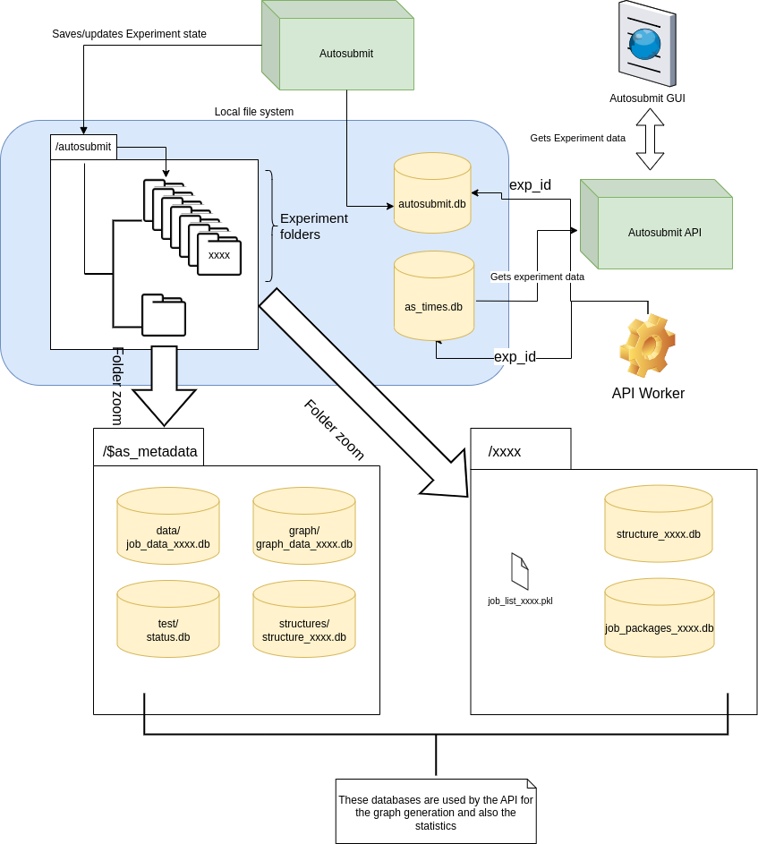

####################
Autosubmit databases
####################

Introduction
------------

Autosubmit stores information about its experiments and workflows in SQLite
databases and as serialized Python objects (pickle files). These are
distributed through the local filesystem, where Autosubmit is installed and runs.

There is one central database that supports the core functionality of
experiments in Autosubmit. There are other auxiliary databases consumed
by Autosubmit and the Autosubmit API, that store finer-grained experiment information.

The name and location of the central database are defined in the ``.autosubmitrc``
configuration file while the other auxiliary databases have a predefined name.
There are also log files with important information about experiment execution and
some other relevant information such as experiment job statuses, timestamps, error
messages among other things inside these files.

.. note::

  The ``<EXPID>`` is an experiment ID. The location of the databases of
  other files can be customized in the ``.autosubmitrc`` configuration file.

Core databases
---------------

+-------------------+------------------------------------+----------------------------------------------------------------------------------------------------------+
| Database          | Default location                   | Description                                                                                              |
+===================+====================================+==========================================================================================================+
| ``autosubmit.db`` | ``$HOME/autosubmit/autosubmit.db`` | The main database of Autosubmit. The location can be customized in the ``autosubmitrc`` file.            |
+-------------------+------------------------------------+----------------------------------------------------------------------------------------------------------+
| ``as_times.db``   | ``$HOME/autosubmit/as_times.db``   | Deprecated API. Used by Autosubmit API with Autosubmit ``3.x``. Kept for backward compatibility for now. |
+-------------------+------------------------------------+----------------------------------------------------------------------------------------------------------+

Auxiliary databases
--------------------

These databases complement the databases previously described for different purposes.
Some of them are centralized in the ``$AS_METADATA`` directory (defined in the
``.autosubmitrc`` config file) while others are present inside each experiment folder.

Databases in the ``$AS_METADATA`` directory
^^^^^^^^^^^^^^^^^^^^^^^^^^^^^^^^^^^^^^^^^^^

+---------------------------+---------------------------------------------------------------+----------------------------------------------------------------------------------------------------------------------------+
| Database                  | Default location                                              | Description                                                                                                                |
+===========================+===============================================================+============================================================================================================================+
| ``graph_data_<EXPID>.db`` | ``$HOME/autosubmit/metadata/graph/graph_data_<EXPID>.db``     | Used by the GUI to improve the graph visualization. Populated by an API worker.                                            |
+---------------------------+---------------------------------------------------------------+----------------------------------------------------------------------------------------------------------------------------+
| ``structure_<EXPID>.db``  | ``$HOME/autosubmit/metadata/structures/structure_<EXPID>.db`` | Used by the GUI to display edge lists. Populated by an API worker.                                                         |
+---------------------------+---------------------------------------------------------------+----------------------------------------------------------------------------------------------------------------------------+
| ``status.db``             | ``$HOME/autosubmit/metadata/test/status.db``                  | Stores the status of the partition where Autosubmit databases and experiment files are stored. Populated by an API worker. |
+---------------------------+---------------------------------------------------------------+----------------------------------------------------------------------------------------------------------------------------+
| ``job_data_<EXPID>.db``   | ``$HOME/autosubmit/metadata/data/job_data_<EXPID>.db``        | Stores experiment metrics and historical information. Populated by Autosubmit.                                             |
+---------------------------+---------------------------------------------------------------+----------------------------------------------------------------------------------------------------------------------------+

Databases in each experiment directory
^^^^^^^^^^^^^^^^^^^^^^^^^^^^^^^^^^^^^^

+-----------------------------+----------------------------------------------------------+--------------------------------------------------------------------------------------------------------------------+
| Database                    | Default location                                         | Description                                                                                                        |
+=============================+==========================================================+====================================================================================================================+
| ``job_packages_<EXPID>.db`` | ``$HOME/autosubmit/<EXPID>/pkl/job_packages_<EXPID>.db`` | Stores information about the wrappers configured in the experiment. Empty if no wrappers configured.               |
+-----------------------------+----------------------------------------------------------+--------------------------------------------------------------------------------------------------------------------+
| ``structure_<EXPID>.db``    | ``$HOME/autosubmit/<EXPID>/pkl/structure_<EXPID>.db``    | Deprecated. Used in Autosubmit ``3.x``, now replaced by the database used by the Autosubmit API (described above). |
+-----------------------------+----------------------------------------------------------+--------------------------------------------------------------------------------------------------------------------+

Other files
-----------

Autosubmit stores Pickle files (e.g. ``$HOME/autosubmit/<EXPID>/pkl/job_list_<EXPID>.pkl``)
with the job list of experiments. In the event of a crash, or if the user stops the
experiment, that Pickle file is used in order to be able to restore the experiment to
its latest status.

There are also update list files, used to change the status of experiment jobs
without stopping Autosubmit. These files are plain text files, and also present
in the experiment directory.
