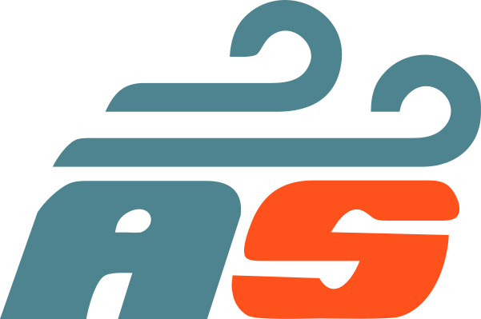
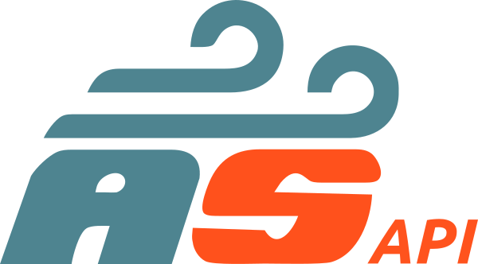
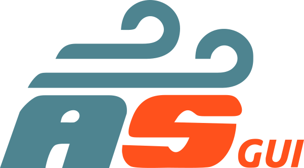
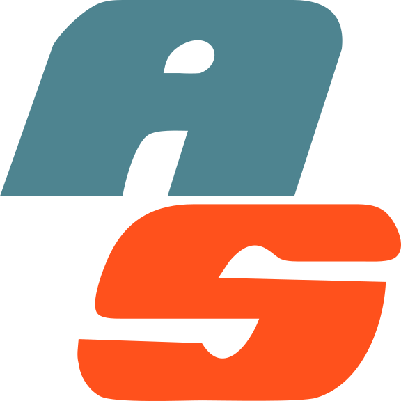

#####
Media
#####

Visual Identity Files
=====================

..
   This is for download buttons
.. |autosubmit.svg| replace::
   :download:`SVG <fig/autosubmit.svg>`
.. |autosubmit.png| replace::
   :download:`PNG <fig/autosubmit.png>`
.. |as_short.svg| replace::
   :download:`SVG <fig/as_short.svg>`
.. |as_short.png| replace::
   :download:`PNG <fig/as_short.png>`
.. |as_api.svg| replace::
   :download:`SVG <fig/as_api.svg>`
.. |as_api.png| replace::
   :download:`PNG <fig/as_api.png>`
.. |as_gui.svg| replace::
   :download:`SVG <fig/as_gui.svg>`
.. |as_gui.png| replace::
   :download:`PNG <fig/as_gui.png>`
.. |as_short_icon.svg| replace::
   :download:`SVG <fig/as_short_icon.svg>`
.. |as_short_icon.png| replace::
   :download:`PNG <fig/as_short_icon.png>`
..
   This is for displaying the images

Autosubmit logos in both SVG and PNG files are available for download:

+-------------------------+---------------------+---------------------+ 
| |img_autosubmit.png|    | |autosubmit.svg|    | |autosubmit.png|    |
+-------------------------+---------------------+---------------------+ 
| |img_as_short.png|      | |as_short.svg|      | |as_short.png|      |
+-------------------------+---------------------+---------------------+  
| |img_as_api.png|        | |as_api.svg|        | |as_api.png|        |  
+-------------------------+---------------------+---------------------+  
| |img_as_gui.png|        | |as_gui.svg|        | |as_gui.png|        |  
+-------------------------+---------------------+---------------------+  
| |img_as_short_icon.png| | |as_short_icon.svg| | |as_short_icon.png| |  
+-------------------------+---------------------+---------------------+  

Presentations
=============

.. raw:: html

    <iframe
        src="https://docs.google.com/presentation/d/e/2PACX-1vSvfOhIr5bfWzjFgLjmN_hySYNcF8tBpyyKeogcsVNWUVwohlnRyl4mtxLJYAxZxsKKjbmd2MMDE4-E/embed?start=false&loop=false&delayms=3000"
        frameborder="0"
        width="100%"
        height="450px"
        allowfullscreen="true"
        mozallowfullscreen="true"
        webkitallowfullscreen="true"></iframe>

`Full Screen <https://docs.google.com/presentation/d/e/2PACX-1vSvfOhIr5bfWzjFgLjmN_hySYNcF8tBpyyKeogcsVNWUVwohlnRyl4mtxLJYAxZxsKKjbmd2MMDE4-E/pub?output=pdf>`_
