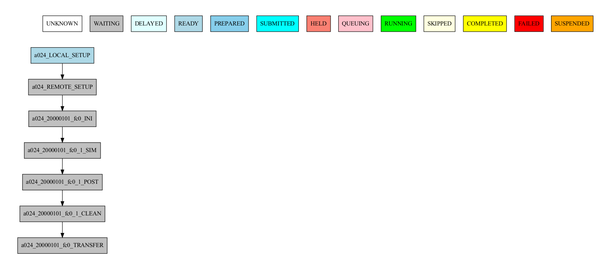

===============
Getting Started
===============

This tutorial is a starter’s guide to run a dummy experiment with Autosubmit.

Dummy experiments run workflows with inexpensive empty tasks and therefore are ideal for teaching and testing purposes.

Real experiments instead run workflows with complex tasks. To read information about how to develop parameterizable tasks for Autosubmit workflows, refer to :ref:`develproject`.

.. _Local Platform:

Pre-requisites
==============

Autosubmit needs to establish **password-less SSH connections** in order to run and monitor workflows on remote platforms.

Ensure that you have a **password-less** connection to all platforms you want to use in your experiment. If you are unsure how to do this, please follow these instructions:

- Open a terminal and prompt ``ssh-keygen -t rsa -b 4096 -C "email@email.com" -m PEM``
- Copy the resulting key to your platform of choice. Via SCP or ssh-copy-key.

.. code-block:: bash

        # Generate a key pair for password-less ssh, PEM format is recommended as others can cause problems
        ssh-keygen -t rsa -b 4096 -C "email@email.com" -m PEM
        # Copy the public key to the remote machine
        ssh-copy-id -i ~/.ssh/id_rsa.pub user@remotehost
        # Add your key to ssh agent ( if encrypted )
        # If not initialized, initialize it
        eval `ssh-agent -s`
        # Add the key
        ssh-add ~/.ssh/id_rsa
        # Where ~/.ssh/id_rsa is the path to your private key


Description of most used commands
=================================

.. list-table::
    :header-rows: 1
    :widths: 20 80

    * - Command
      - Short description
    * - **expid**
      - Creates a new experiment and generates a new entry in the database by giving it a serial id composed of 4 letters. In addition, it also creates the folder experiment and the basic folder structure.
    * - **create <EXPID>**
      - Generates the experiment workflow.
    * - **run <EXPID>**
      - Runs the experiment workflow.
    * - **monitor <EXPID>**
      - Shows the experiment workflow structure and status.
    * - **inspect <EXPID>**
      - Generates Autosubmit scripts and batch scripts for inspection, by processing the tasks’ templates with the experiment parameters.
    * - **refresh <EXPID>**
      - Updates the project directory.
    * - **recovery <EXPID>**
      - Recovers the experiment workflow obtaining the last run complete jobs.
    * - **setstatus <EXPID>**
      - Sets one or multiple jobs status to a given value.


Create a new experiment
=======================

.. runcmd:: autosubmit expid -dm -H "local" -d "Tutorial"

- *-dm: Generates a dummy experiment.*
- *-H: Sets the principal experiment platform.*
- *-d: Sets a short description for the experiment.*

The output of the command will show the <EXPID> of the experiment and generate the following directory structure:

.. list-table::
    :header-rows: 1
    :widths: 20 80

    * - Experiment folder
      - Contains
    * - conf
      - Experiment configuration files.
    * - pkl
      - Workflow pkl files.
    * - plot
      - Visualization output files
    * - tmp
      - Logs, templates and misc files.
    * - proj
      - User scripts and  project code. (empty)


Then, execute ``autosubmit create <EXPID> -np`` and Autosubmit will generate the workflow graph.

.. runcmd:: autosubmit create a000 -o png --hide
    :silent-output: 1
    :prompt:

Run and monitoring
==================

 To run an experiment, use ```autosubmit run <EXPID>```. Autosubmit runs experiments performing the following operations:

 - First, it **checks the experiment configuration**. If it is wrong, it won't proceed further.
 - Second, it **runs the experiment while retrieving all logs** from completed or failed tasks as they run.
 - Third, it manages all the **workflow steps by following the dependencies defined by the user** until all jobs are in COMPLETED or FAILED status. There can be jobs left in **WAITING** status if their dependencies are in **FAILED** status.

While the experiment is running, it can be visualized via ``autosubmit monitor <EXPID>``.

.. runcmd:: find /home/docs/autosubmit/a000/plot/ -iname "*a000_*.png" -true -exec mv -- {} ./qstartguide/dummy.png \;
    :silent-output: 1
    :prompt:



illustrates the output of the autosubmit monitor. It describes all workflow jobs' possible status and actual status.


Concurrently, the ``<EXPID>/tmp`` gets filled with the cmd scripts generated by Autosubmit to run the local and remote tasks (in this case, they are sent and submitted to the remote platform(s)).

Autosubmit keeps logs at ``ASLOGS`` and ``LOG_<EXPID>`` folders, which are filled up with Autosubmit's command logs and job logs.

Viewing the logs
================

The ``autosubmit`` commands such as ``EXPID``, ``run``, ``monitor``, all may produce
log files on the user's file system. To save the user from having to navigate to the
log file, or to memorize the location of these files, Autosubmit provides the
``autosubmit cat-log`` command.

.. TODO: add a link to complete docs of ``cat-log`` (we must have similar page(s) for each AS sub-command).

.. runcmd:: autosubmit cat-log a000

.. note::
    The ``-f`` (``--file``) option is for the file type, not the file path.
    See the complete help and syntax with ``autosubmit cat-log --help`` for
    a list of supported types, depending on whether you choose a workflow
    log or a job log file. Note too that there is a ``-i`` (``--inspect``)
    flag in the command to tell Autosubmit you want job files generated by
    ``autosubmit inspect``, instead of job files generated by ``autosubmit run``.

Configuration summary
=====================

 In the folder ``<EXPID>/conf`` there are different files that define the actual experiment configuration.

.. list-table::
    :header-rows: 1
    :widths: 20 80

    * - File
      - Content
    * - ``expdef_<EXPID>.yml``
      -
        * It contains the default platform, the one set with -H.
        * Allows changing the start dates, members and chunks.
        * Allows changing the experiment project source ( git, local, svn or dummy)
    * - ``platforms_<EXPID>.yml``
      -
        * It contains the list of platforms to use in the experiment.
        * This file contains the definitions for managing clusters, fat-nodes and support computers.
        * This file must be filled-up with the platform(s) configuration(s).
        * Several platforms can be defined and used in the same experiment.
    * - ``jobs_<EXPID>.yml``
      -
        - It contains the tasks' definitions in sections. Depending on the parameters, one section can generate multiple similar tasks.
        - This file must be filled-up with the tasks' definitions.
        - Several sections can be defined and used in the same experiment.
    * - ``autosubmit_<EXPID>.yml``
      -
        - This file contains the definitions that impact the workflow behavior.
        - It changes workflow behavior with parameters such as job limitations, remote_dependencies and retrials.
        - It extends autosubmit functionalities with parameters such as wrappers and mail notification.
    * - ``proj_<EXPID>.yml``
      -
        - This file contains the configuration used by the user scripts.
        - This file is fully customizable for the current experiment. Allows setting user- parameters that will be readable by the autosubmit jobs.


Final step: Modify and run
==========================

 It is time to look into the configuration files of the dummy experiment and modify them with a remote platform to run a workflow with a few more chunks.

 Open expdef_<EXPID>.yml

.. runcmd:: cat /home/docs/autosubmit/a000/conf/expdef_a000.yml

Now open platforms_<EXPID>.yml. Note: This will be an example for marenostrum4

.. runcmd:: cat /home/docs/autosubmit/a000/conf/platforms_a000.yml

``autosubmit create <EXPID>** (without -np)`` will generate the new workflow and ``autosubmit run <EXPID>`` will run the experiment with the latest changes.

.. warning::
    If you are using an encrypted key, you will need to add it to the ssh-agent before running the experiment. To do so, run ``ssh-add <path_to_key>``.