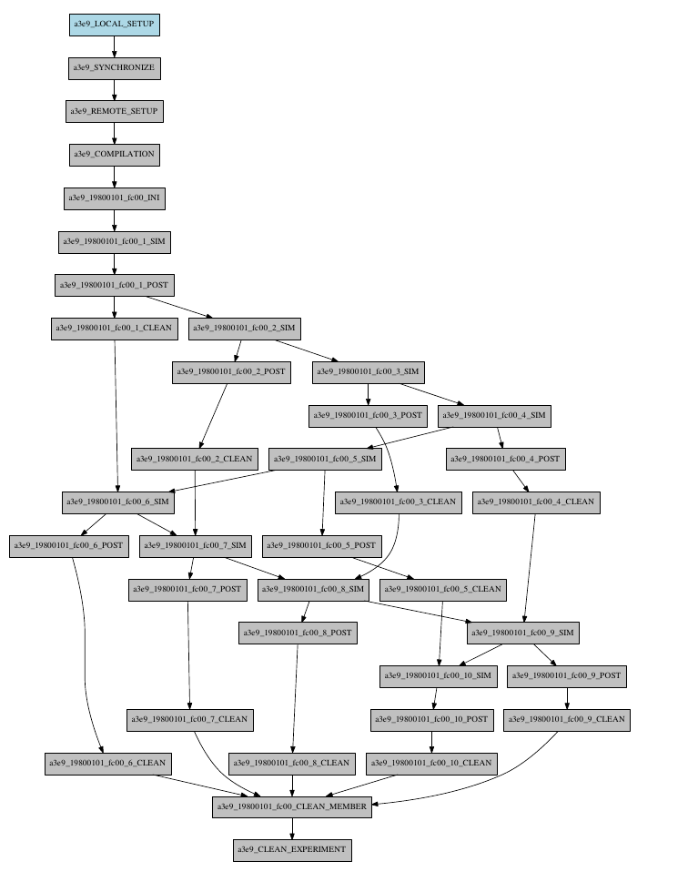

How to add a new job
====================

To add a new job, open the <experiments_directory>/cxxx/conf/jobs_cxxx.conf file where cxxx is the experiment
identifier and add this text:

.. code-block:: ini

    [new_job]
    FILE = <new_job_template>

This will create a new job named "new_job" that will be executed once at the default platform. This job will user the
template located at <new_job_template> (path is relative to project folder).

This is the minimum job definition and usually is not enough. You usually will need to add some others parameters:

* PLATFORM: allows you to execute the job in a platform of your choice. It must be defined in the experiment's
  platforms.conf file or to have the value 'LOCAL' that always refer to the machine running Autosubmit

* RUNNING: defines if jobs runs only once or once per start-date, member or chunk. Options are: once, date,
  member, chunk

* DEPENDENCIES: defines dependencies from job as a list of parents jobs separated by spaces. For example, if
  'new_job' has to wait for "old_job" to finish, you must add the line "DEPENDENCIES = old_job". For dependencies to
  jobs running in previous chunks, members or start-dates, use -(DISTANCE). For example, for a job "SIM" waiting for
  the previous "SIM" job to finish, you have to add "DEPENDENCIES = SIM-1"

* SELECT_CHUNKS (optional) : by default, Autosubmit jobs depends on all dependencies chunks (if parent job RUNNING == chunk) , with this parameter you will be able to  select the ones that you want, you can watch some examples at the bottom of this page.

For jobs running in HPC platforms, usually you have to provide information about processors, wallclock times and more.
To do this use:

* WALLCLOCK: wallclock time to be submitted to the HPC queue in format HH:MM

* PROCESSORS: processors number to be submitted to the HPC. If not specified, defaults to 1.

* THREADS:  threads number to be submitted to the HPC. If not specified, defaults to 1.

* TASKS: tasks number to be submitted to the HPC. If not specified, defaults to 1.

* QUEUE: queue to add the job to. If not specificied, uses PLATFORM default.

There are also other, less used features that you can use:

* FREQUENCY: specifies that a job has only to be run after X dates, members or chunk. A job will always be created for
  the last one. If not specified, defaults to 1

* SYNCHRONIZE: specifies that a job with RUNNING=chunk, has to synchronize its dependencies chunks at a 'date' or
  'member' level, which means that the jobs will be unified: one per chunk for all members or dates.
  If not specified, the synchronization is for each chunk of all the experiment.

* RERUN_ONLY: determines if a job is only to be executed in reruns. If not specified, defaults to false.

* RERUN_DEPENDENCIES: defines the jobs to be rerun if this job is going to be rerunned. Syntax is identical to
  the used in DEPENDENCIES

* CUSTOM_DIRECTIVES: Custom directives for the HPC resource manager headers of the platform used for that job.

* SKIPPABLE: When this is true, the job will be able to skip it work if there is an higher chunk or member already ready, running, queuing or in complete status.

Workflow examples:
==================

Example 1:
----------

In this first example, you can see 3 jobs in which last job (POST) shows an example with select chunks:

.. code-block:: ini

    [INI]
    FILE = templates/common/ini.tmpl.sh
    RUNNING = member
    WALLCLOCK = 00:30
    QUEUE = debug
    CHECK = true

    [SIM]
    FILE = templates/ecearth3/ecearth3.sim
    DEPENDENCIES = INI
    RUNNING = chunk
    WALLCLOCK = 04:00
    PROCESSORS = 1616
    THREADS = 1
    TASKS = 1

    [POST]
    FILE = templates/common/post.tmpl.sh
    DEPENDENCIES =  SIM
    RUNNING = chunk
    WALLCLOCK = 01:00
    QUEUE = Debug
    check = true
    # Then you can select the specific chunks of dependency SIM with one of those lines:

    SELECT_CHUNKS = SIM*[1]*[3] # Will do the dependency of chunk 1 and chunk 3. While chunks 2,4  won't be linked.
    SELECT_CHUNKS = SIM*[1:3] #Enables the dependency of chunk 1,2 and 3. While 4 won't be linked.
    SELECT_CHUNKS = SIM*[1,3] #Enables the dependency of chunk 1 and 3. While 2 and 4 won't be linked
    SELECT_CHUNKS = SIM*[1] #Enables the dependency of chunk 1. While 2, 3 and 4 won't be linked

Example 2: select_chunks
------------------------

In this workflow you can see an illustrated example of select_chunks used in an actual workflow, to avoid an excess of information we only will see the configuration of a single job:

.. code-block:: ini

    [SIM]
    FILE = templates/sim.tmpl.sh
    DEPENDENCIES = INI SIM-1 POST-1 CLEAN-5
    SELECT_CHUNKS = POST*[1]
    RUNNING = chunk
    WALLCLOCK = 0:30
    PROCESSORS = 768

Example 3: SKIPPABLE
--------------------

In this workflow you can see an illustrated example of SKIPPABLE parameter used in an dummy workflow.

.. code-block:: ini

    [SIM]
    FILE = sim.sh
    DEPENDENCIES = INI POST-1
    WALLCLOCK = 00:15
    RUNNING = chunk
    QUEUE = debug
    SKIPPABLE = TRUE

    [POST]
    FILE = post.sh
    DEPENDENCIES = SIM
    WALLCLOCK = 00:05
    RUNNING = member
    #QUEUE = debug

.. figure:: ../../workflows/skip.png
   :name: simple
   :width: 100%
   :align: center
   :alt: skip_workflow
