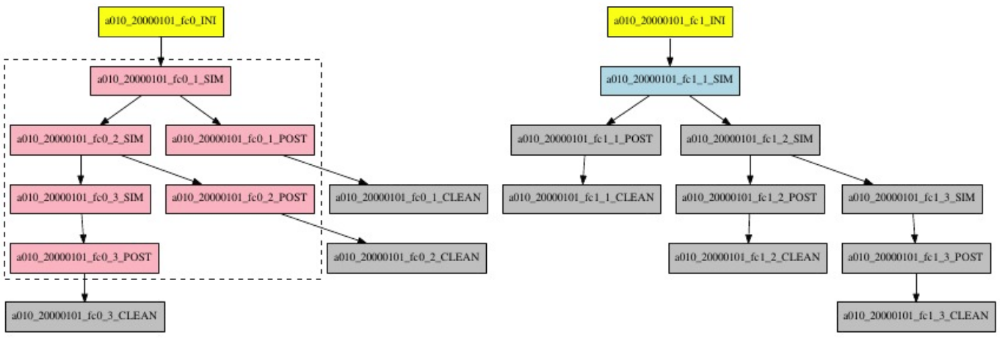

############
Wrappers
############

In order to understand the goal of this feature, please take a look at: https://earth.bsc.es/wiki/lib/exe/fetch.php?media=library:seminars:techniques_to_improve_the_throughput.pptx

How to configure
========================

In ``autosubmit_cxxx.conf``, increase the value of the variables:

.. code-block:: ini

    ...
    MAXWAITINGJOBS = 100
    TOTALJOBS = 100
    ...

and include the wrapper directive:

.. code-block:: ini

    [wrapper]
    TYPE = {VERTICAL,HORIZONTAL}
    EXPRESSION = <JOB_SECTION1 JOB_SECTION2> # the sections must be separated by space
    # option to limit the number of jobs wrapped together. Default = TOTALJOBS
    MAXWRAPPEDJOBS = 10
    DEPENDENCIES = True # default is False

In order to be able to use the vertical wrapper, in ``platforms_cxxx.conf`` set the maximum wallclock allowed by the platform in use:

.. code-block:: ini

    [marenostrum4]
    ...
    MAX_WALLCLOCK = 72:00

.. important::  Note that the **numbers** shown in this documentation are examples. The actual values must be set according to the specific workflow, as well as the platform configurations.

For example, in the case of the vertical wrapper, if the maximum wallclock for the platform is 72 hours and each simulation takes 2 hours to complete,
then this will be the most limiting factor, and even if **MAXWRAPPEDJOBS** is greater than 36, no more than 36 simulations could be wrapped together.

Note that the solution considers the order of the sections defined in the ``jobs_cxxx.conf`` file, so the order of the sections given in the expression is irrelevant.
Additionally, jobs are grouped within the corresponding date, member and chunk hierarchy.

- If **EXPRESSION** is NOT specified:
    - Jobs from the same section can be wrapped together
        - A job is only added to a package if its parent(s) are COMPLETED or within the same package

- If **EXPRESSION** is specified:
    - Jobs from the sections defined in the expression can/will be wrapped together
    - Parent needs to be COMPLETED or within the same package
    - Jobs from sections not in the expression are not packed

- **MAX_WRAPPED** can be defined in ``jobs_cxxx.conf`` in order to limit the number of jobs wrapped for the corresponding job section
    - If not defined, it considers the **MAXWRAPPEDJOBS** defined in ``autosubmit_cxxx.conf``
        - If **MAXWRAPPEDJOBS** is not defined, then **TOTALJOBS** is used by default

**Remote dependencies**

There is also the possibility of setting the option **DEPENDENCIES** to True in the wrapper directive. This allows more than one package containing wrapped jobs to be submitted at the same time.
Even when the dependencies between jobs aren't satisfied. This is useful because the sooner a job is submitted the better, as it jobs that have been longer in the queue have more priority.
For the job scheduler, the dependencies are set between the submitted packages. In the case of the vertical wrapper, the packages will be limited by the sum of the wallclock of all jobs in the package.
However, new packages can be created as long as the total number of jobs are below than the number defined in the **TOTALJOBS** variable.

**Example and visualization**

When using the wrapper, it is useful to be able to visualize which packages are being created. So, when executing *autosubmit monitor cxxx*, a dashed box indicates the jobs that are packed together.

.. figure:: ../workflows/wrapper.png
   :name: wrapper
   :width: 100%
   :align: center
   :alt: wrapped jobs

Considering a very simple workflow with the configurations as follows:

.. code-block:: ini

    [wrapper]
    TYPE = vertical
    EXPRESSION = SIM POST
    MAXWRAPPEDJOBS = 10

The following image shows an example of the visualization of how jobs are wrapped together in packages:

