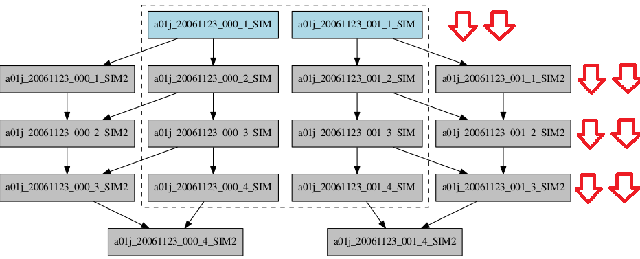

############
Wrappers
############

In order to understand the goal of this feature, please take a look at: https://earth.bsc.es/wiki/lib/exe/fetch.php?media=library:seminars:techniques_to_improve_the_throughput.pptx

At the moment there are 4 types of wrappers that can be used depending on the experiment's workflow:

* Vertical
* Vertical mixed
* Horizontal
* Hybrid

How to configure
========================

In ``autosubmit_cxxx.conf``, regardless of the wrapper type, you need to make sure that the values of the variables **MAXWAITINGJOBS** and **TOTALJOBS** are increased according to the number of jobs expected to be waiting/running at the same time in your experiment.

For example:

.. code-block:: ini

    [config]
    EXPID = ....
    AUTOSUBMIT_VERSION = 3.10.0
    ...

    MAXWAITINGJOBS = 100
    TOTALJOBS = 100
    ...

and below the [config] block, add the wrapper directive, indicating the wrapper type:

.. code-block:: ini

    [wrapper]
    TYPE =

You can also specify which job types should be wrapped. This can be done using the **JOBS_IN_WRAPPER** parameter.
It is only required for the vertical-mixed type (in which the specified job types will be wrapped together), so if nothing is specified, all jobs will be wrapped.
By default, jobs of the same type will be wrapped together, as long as the constraints are satisfied.

Number of jobs in a package
**********************

- **MAX_WRAPPED** can be defined in ``jobs_cxxx.conf`` in order to limit the number of jobs wrapped for the corresponding job section
    - If not defined, it considers the **MAXWRAPPEDJOBS** defined under [wrapper] in ``autosubmit_cxxx.conf``
        - If **MAXWRAPPEDJOBS** is not defined, then **TOTALJOBS** is used by default

Wrapper check time
**********************

It is possible to override the **SAFETYSLEEPTIME** for the wrapper, by using **CHECK_TIME_WRAPPER** and defining a time interval (in seconds) in which the wrapper internal jobs should be checked.

.. important::  Note that the **numbers** shown in this documentation are examples. The actual values must be set according to the specific workflow, as well as the platform configurations.

Vertical wrapper
=======================

The vertical wrapper is more appropriate when there are many sequential jobs. To use it, set TYPE = vertical:

.. code-block:: ini

    [wrapper]
    TYPE = vertical

In order to be able to use the vertical wrapper, in ``platforms_cxxx.conf`` set the maximum wallclock allowed by the platform in use:

.. code-block:: ini

    [marenostrum4]
    ...
    MAX_WALLCLOCK = 72:00

Remember to add to each job the corresponding WALLCLOCK time.

Vertical-mixed wrapper
=======================

This is a version of the vertical wrapper that allows jobs of different types to be wrapped together.
Note that the solution considers the order of the sections defined in the ``jobs_cxxx.conf`` file, so the order of the sections given in **JOBS_IN_WRAPPER** is irrelevant.
Additionally, jobs are grouped within the corresponding date, member and chunk hierarchy.

.. code-block:: ini

    [wrapper]
    TYPE = vertical-mixed
    JOBS_IN_WRAPPER = <JOB_SECTION1 JOB_SECTION2> # REQUIRED

Horizontal wrapper
==========================

The horizontal wrapper is more appropriate when there are multiple ensemble members that can be run in parallel.

.. code-block:: ini

    [wrapper]
    TYPE = horizontal

In order to be able to use the horizontal wrapper, in ``platforms_cxxx.conf`` set the maximum number of processors allowed by the platform in use:

.. code-block:: ini

    [marenostrum4]
    ...
    MAX_PROCESSORS = 2400

Remote dependencies
**********************

There is also the possibility of setting the option **DEPENDENCIES** to True in the wrapper directive (**ONLY** for vertical or horizontal wrappers).

This allows more than one package containing wrapped jobs to be submitted at the same time, even when the dependencies between jobs aren't yet satisfied. This is only useful for cases when the job scheduler considers the time a job has been queuing to determine the job's priority (and the scheduler understands the dependencies set between the submitted packages). New packages can be created as long as the total number of jobs are below than the number defined in the **TOTALJOBS** variable.

.. code-block:: ini

    [wrapper]
    TYPE = vertical
    DEPENDENCIES = True

Hybrid wrapper
==========================

The hybrid wrapper is a wrapper that works both vertically and horizontally at the same time, meaning that members and chunks can be wrapped in one single job.

.. code-block:: ini

    [wrapper]
    TYPE = hybrid

Summary
==========================

In `autosubmit_cxxx.conf`:

.. code-block:: ini

    [wrapper]
    TYPE = {vertical,vertical-mixed,horizontal,hybrid} # REQUIRED
    JOBS_IN_WRAPPER = # Job types (as defined in jobs_cxxx.conf) separated by space. REQUIRED only if vertical-mixed
    CHECK_TIME_WRAPPER = # OPTIONAL. Time in seconds, overrides SAFETYSLEEPTIME
    DEPENDENCIES = {True,False} # OPTIONAL. False if not specified
    MAXWRAPPEDJOBS = # OPTIONAL. Integer value, overrides TOTALJOBS

In `platforms_cxxx.conf`:

.. code-block:: ini

    [marenostrum4]
    ...
    MAX_WALLCLOCK =
    MAX_PROCESSORS =
    PROCESSORS_PER_NODE = 48

Visualization examples
===============================

When using the wrapper, it is useful to be able to visualize which packages are being created.
So, when executing *autosubmit monitor cxxx*, a dashed box indicates the jobs that are wrapped together in the same job package.

Vertical-mixed wrapper
**********************

Considering a very simple workflow with the configurations as follows:

.. code-block:: ini

    [wrapper]
    TYPE = vertical-mixed
    JOBS_IN_WRAPPER = SIM POST

.. figure:: ../workflows/wrapper.png
   :name: wrapper
   :width: 100%
   :align: center
   :alt: wrapped jobs

Horizontal wrapper with remote dependencies
**********************

.. code-block:: ini

   [wrapper]
   TYPE = horizontal
   JOBS_IN_WRAPPER = SIM POST
   DEPENDENCIES = True

.. figure:: ../workflows/horizontal_remote.png
   :name: horizontal_remote
   :width: 60%
   :align: center
   :alt: horizontally wrapped jobs

Hybrid wrapper
**********************

Mixed approach using a combination of horizontal and vertical wrappers. The list of jobs is a list of lists.

Horizontal-vertical
===========================

- There is a dependency between lists. Each list runs after the previous one finishes; the jobs within the list run in parallel at the same time
- It is particularly suitable if there are jobs of different types in the list with different wall clocks, but dependencies between jobs of different lists; it waits for all the jobs in the list to finish before starting the next list

.. code-block:: ini

    [wrapper]
    TYPE = horizontal-vertical
    JOBS_IN_WRAPPER = SIM POST

.. figure:: ../workflows/horizontal-vertical.png
   :name: wrapper_horizontal_vertical
   :width: 80%
   :align: center
   :alt: hybrid wrapper

Vertical-horizontal
===========================

- In this approach, each list is independent of each other and run in parallel; jobs within the list run one after the other
- It is particularly suitable for running many sequential ensembles

.. code-block:: ini

    [wrapper]
    TYPE = vertical-horizontal
    JOBS_IN_WRAPPER = SIM POST

