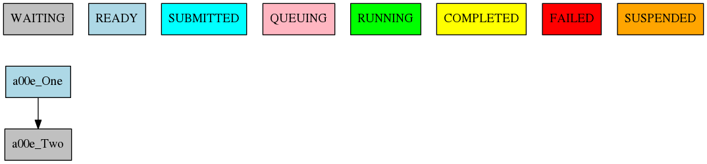
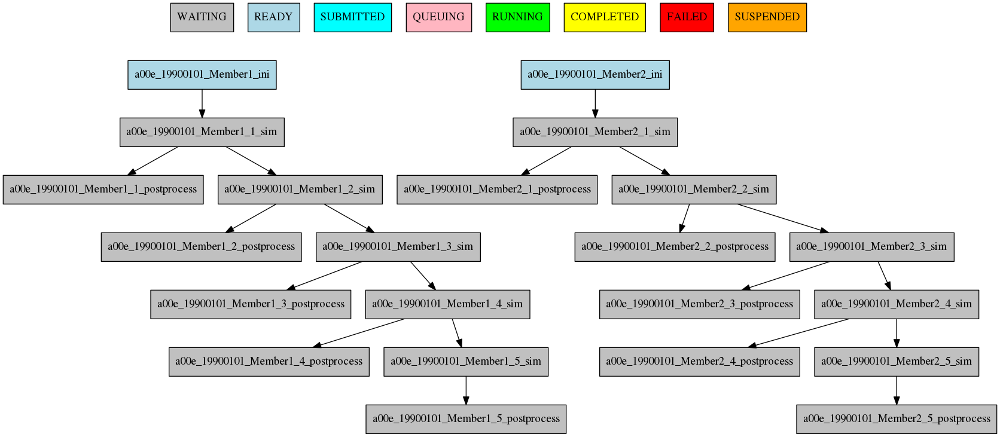
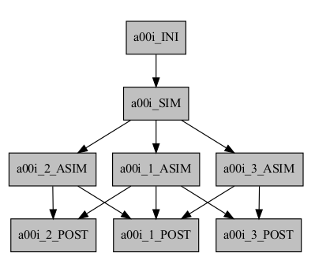
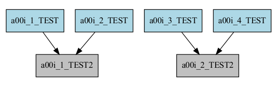
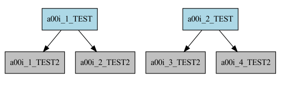
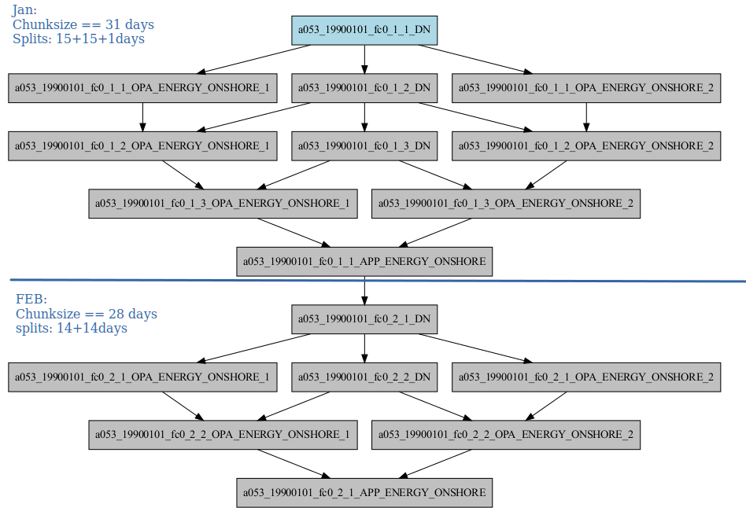
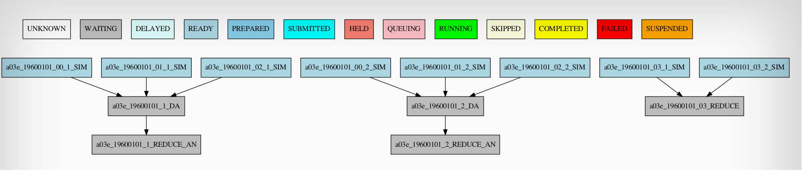
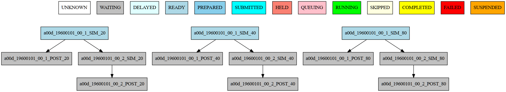

Defining the workflow
=====================

One of the most important step that you have to do when planning to use autosubmit for an experiment is the definition
of the workflow the experiment will use. In this section you will learn about the workflow definition syntax so you will
be able to exploit autosubmit's full potential

.. warning::
   This section is NOT intended to show how to define your jobs. Please go to :doc:`/qstartguide/index` section for a comprehensive
   list of job options.

Simple workflow
---------------

The simplest workflow that can be defined it is a sequence of two jobs, with the second one triggering at the end of
the first. To define it, we define the two jobs and then add a DEPENDENCIES attribute on the second job referring to the
first one.

It is important to remember when defining workflows that DEPENDENCIES on autosubmit always refer to jobs that should
be finished before launching the job that has the DEPENDENCIES attribute.

.. code-block:: yaml

  JOBS:
    One:
      FILE: one.sh

    Two:
      FILE: two.sh
      DEPENDENCIES: One

The resulting workflow can be seen in Figure :numref:`simple`

   Example showing a simple workflow with two sequential jobs

Running jobs once per startdate, member or chunk
------------------------------------------------

Autosubmit is capable of running ensembles made of various startdates and members. It also has the capability to
divide member execution on different chunks.

To set at what level a job has to run you have to use the RUNNING attribute. It has four possible values: once, date,
member and chunk corresponding to running once, once per startdate, once per member or once per chunk respectively.

.. code-block:: yaml

    EXPERIMENT:
      DATELIST: 19900101 20000101
      MEMBERS: Member1 Member2
      CHUNKSIZEUNIT: month
      CHUNKSIZE: '4'
      NUMCHUNKS: '2'
      CHUNKINI: ''
      CALENDAR: standard

.. code-block:: yaml
    
    JOBS:
      once:
          FILE: Once.sh

      date:
          FILE: date.sh
          DEPENDENCIES: once
          RUNNING: date

      member:
          FILE: Member.sh
          DEPENDENCIES: date
          RUNNING: member

      chunk:
          FILE: Chunk.sh
          DEPENDENCIES: member
          RUNNING: chunk

The resulting workflow can be seen in Figure :numref:`running` for a experiment with 2 startdates, 2 members and 2 chunks.

.. figure:: fig/running.png
   :name: running
   :width: 100%
   :align: center
   :alt: simple workflow plot

   Example showing how to run jobs once per startdate, member or chunk.

Dependencies
------------

Dependencies on autosubmit were introduced on the first example, but in this section you will learn about some special
cases that will be very useful on your workflows.

Dependencies with previous jobs
~~~~~~~~~~~~~~~~~~~~~~~~~~~~~~~

Autosubmit can manage dependencies between jobs that are part of different chunks, members or startdates. The next
example will show how to make a simulation job wait for the previous chunk of the simulation. To do that, we add
sim-1 on the DEPENDENCIES attribute. As you can see, you can add as much dependencies as you like separated by spaces

.. code-block:: yaml

   JOBS:
    ini:
        FILE: ini.sh
        RUNNING: member

    sim:
        FILE: sim.sh
        DEPENDENCIES: ini sim-1
        RUNNING: chunk

    postprocess:
        FILE: postprocess.sh
        DEPENDENCIES: sim
        RUNNING: chunk

The resulting workflow can be seen in Figure :numref:`dprevious`

.. warning::

   Autosubmit simplifies the dependencies, so the final graph usually does not show all the lines that you may expect to
   see. In this example you can see that there are no lines between the ini and the sim jobs for chunks 2 to 5 because
   that dependency is redundant with the one on the previous sim

   Example showing dependencies between sim jobs on different chunks.

Dependencies between running levels
~~~~~~~~~~~~~~~~~~~~~~~~~~~~~~~~~~~

On the previous examples we have seen that when a job depends on a job on a higher level (a running chunk job depending
on a member running job) all jobs wait for the higher running level job to be finished. That is the case on the ini sim dependency
on the next example.

In the other case, a job depending on a lower running level job, the higher level job will wait for ALL the lower level
jobs to be finished. That is the case of the postprocess combine dependency on the next example.

.. code-block:: yaml

    JOBS:
      ini:
          FILE: ini.sh
          RUNNING: member

      sim:
          FILE: sim.sh
          DEPENDENCIES: ini sim-1
          RUNNING: chunk

      postprocess:
          FILE: postprocess.sh
          DEPENDENCIES: sim
          RUNNING: chunk

      combine:
          FILE: combine.sh
          DEPENDENCIES: postprocess
          RUNNING: member

The resulting workflow can be seen in Figure :numref:`dependencies`

.. figure:: fig/dependencies_running.png
   :name: dependencies
   :width: 100%
   :align: center
   :alt: simple workflow plot

   Example showing dependencies between jobs running at different levels.

Dependencies rework
~~~~~~~~~~~~~~~~~~~

The DEPENDENCIES key is used to define the dependencies of a job. It can be used in the following ways:

* Basic: The dependencies are a list of jobs, separated by " ", that runs before the current task is submitted.
* New: The dependencies is a list of YAML sections, separated by "\n", that runs before the current job is submitted.

  * For each dependency section, you can designate the following keywords to control the current job-affected tasks:

    * DATES_FROM: Selects the job dates that you want to alter.
    * MEMBERS_FROM: Selects the job members that you want to alter.
    * CHUNKS_FROM: Selects the job chunks that you want to alter.

  * For each dependency section and \*_FROM keyword, you can designate the following keywords to control the destination of the dependency:

    * DATES_TO: Links current selected tasks to the dependency tasks of the dates specified.
    * MEMBERS_TO: Links current selected tasks to the dependency tasks of the members specified.
    * CHUNKS_TO: Links current selected tasks to the dependency tasks of the chunks specified.

  * Important keywords for [DATES|MEMBERS|CHUNKS]_TO:

    * "natural": Will keep the default linkage. Will link if it would be normally. Example, SIM_FC00_CHUNK_1 -> DA_FC00_CHUNK_1.
    * "all": Will link all selected tasks of the dependency with current selected tasks. Example, SIM_FC00_CHUNK_1 -> DA_FC00_CHUNK_1, DA_FC00_CHUNK_2, DA_FC00_CHUNK_3...
    * "none": Will unlink selected tasks of the dependency with current selected tasks.

For the new format, consider that the priority is hierarchy and goes like this DATES_FROM -(includes)-> MEMBERS_FROM -(includes)-> CHUNKS_FROM.

* You can define a DATES_FROM inside the DEPENDENCY.
* You can define a MEMBERS_FROM inside the DEPENDENCY and DEPENDENCY.DATES_FROM.
* You can define a CHUNKS_FROM inside the DEPENDENCY, DEPENDENCY.DATES_FROM, DEPENDENCY.MEMBERS_FROM, DEPENDENCY.DATES_FROM.MEMBERS_FROM

Start conditions
~~~~~~~~~~~~~~~~

Sometimes you want to run a job only when a certain condition is met. For example, you may want to run a job only when a certain task is running.
This can be achieved using the START_CONDITIONS feature based on the dependencies rework.

Start conditions are achieved by adding the keyword ``STATUS`` and optionally ``FROM_STEP`` keywords into any dependency that you want.

The ``STATUS`` keyword can be used to select the status of the dependency that you want to check. The possible values ( case-insensitive ) are:

* "WAITING": The task is waiting for its dependencies to be completed.
* "DELAYED": The task is delayed by a delay condition.
* "PREPARED": The task is prepared to be submitted.
* "READY": The task is ready to be submitted.
* "SUBMITTED": The task is submitted.
* "HELD": The task is held.
* "QUEUING": The task is queuing.
* "RUNNING": The task is running.
* "SKIPPED": The task is skipped.
* "FAILED": The task is failed.
* "UNKNOWN": The task is unknown.
* "COMPLETED": The task is completed. # Default
* "SUSPENDED": The task is suspended.

The status are ordered, so if you select "RUNNING" status, the task will be run if the parent is in any of the following statuses: "RUNNING", "QUEUING", "HELD", "SUBMITTED", "READY", "PREPARED", "DELAYED", "WAITING".

.. code-block:: yaml

    JOBS:
      ini:
          FILE: ini.sh
          RUNNING: member

      sim:
          FILE: sim.sh
          DEPENDENCIES: ini sim-1
          RUNNING: chunk

      postprocess:
          FILE: postprocess.sh
          DEPENDENCIES:
              SIM:
                  STATUS: "RUNNING"
          RUNNING: chunk

The ``FROM_STEP`` keyword can be used to select the **internal** step of the dependency that you want to check. The possible value is an integer. Additionally, the target dependency, must call to `%AS_CHECKPOINT%` inside their scripts. This will create a checkpoint that will be used to check the amount of steps processed.

.. code-block:: yaml

  JOBS:
    A:
      FILE: a.sh
      RUNNING: once
      SPLITS: 2
    A_2:
      FILE: a_2.sh
      RUNNING: once
      DEPENDENCIES:
        A:
          SPLIT_TO: "2"
          STATUS: "RUNNING"
          FROM_STEP: 2

There is now a new function that is automatically added in your scripts which is called ``as_checkpoint``. This is the function that is generating the checkpoint file. You can see the function below:

.. code-block:: bash

    ###################
    # AS CHECKPOINT FUNCTION
    ###################
    # Creates a new checkpoint file upon call based on the current numbers of calls to the function

    AS_CHECKPOINT_CALLS=0
    function as_checkpoint {
        AS_CHECKPOINT_CALLS=$((AS_CHECKPOINT_CALLS+1))
        touch ${job_name_ptrn}_CHECKPOINT_${AS_CHECKPOINT_CALLS}
    }

And what you would have to include in your target dependency or dependencies is the call to this function which in this example is a.sh.

The amount of calls is strongly related to the ``FROM_STEP`` value.

``$expid/proj/$projname/as.sh``

.. code-block:: bash

  ##compute somestuff
  as_checkpoint
  ## compute some more stuff
  as_checkpoint

To select an specific task, you have to combine the ``STATUS`` and ``CHUNKS_TO`` , ``MEMBERS_TO`` and ``DATES_TO``, ``SPLITS_TO`` keywords.

.. code-block:: yaml

  JOBS:
    A:
      FILE: a
      RUNNING: once
      SPLITS: 1
    B:
      FILE: b
      RUNNING: once
      SPLITS: 2
      DEPENDENCIES: A
    C:
      FILE: c
      RUNNING: once
      SPLITS: 1
      DEPENDENCIES: B
    RECOVER_B_2:
      FILE: fix_b
      RUNNING: once
      DEPENDENCIES:
        B:
          SPLIT_TO: "2"
          STATUS: "RUNNING"

Job frequency
~~~~~~~~~~~~~

Some times you just don't need a job to be run on every chunk or member. For example, you may want to launch the postprocessing
job after various chunks have completed. This behaviour can be achieved using the FREQUENCY attribute. You can specify
an integer I for this attribute and the job will run only once for each I iterations on the running level.

.. hint::
   You don't need to adjust the frequency to be a divisor of the total jobs. A job will always execute at the last
   iteration of its running level

.. code-block:: yaml

    JOBS:
      ini:
          FILE: ini.sh
          RUNNING: member

      sim:
          FILE: sim.sh
          DEPENDENCIES: ini sim-1
          RUNNING: chunk

      postprocess:
          FILE: postprocess.sh
          DEPENDENCIES: sim
          RUNNING: chunk
          FREQUENCY: 3

      combine:
          FILE: combine.sh
          DEPENDENCIES: postprocess
          RUNNING: member

The resulting workflow can be seen in Figure :numref:`frequency`

.. figure:: fig/frequency.png
   :name: frequency
   :width: 100%
   :align: center
   :alt: simple workflow plot

   Example showing dependencies between jobs running at different frequencies.

Job synchronize
~~~~~~~~~~~~~~~

For jobs running at chunk level, and this job has dependencies, you could want
not to run a job for each experiment chunk, but to run once for all member/date dependencies, maintaining
the chunk granularity. In this cases you can use the SYNCHRONIZE job parameter to determine which kind
of synchronization do you want. See the below examples with and without this parameter.

.. hint::
   This job parameter works with jobs with RUNNING parameter equals to 'chunk'.

.. code-block:: ini

    JOBS:
      ini:
          FILE: ini.sh
          RUNNING: member

      sim:
          FILE: sim.sh
          DEPENDENCIES: INI SIM-1
          RUNNING: chunk

      ASIM:
          FILE: asim.sh
          DEPENDENCIES: SIM
          RUNNING: chunk

The resulting workflow can be seen in Figure :numref:`nosync`

.. figure:: fig/no-synchronize.png
   :name: nosync
   :width: 100%
   :align: center
   :alt: simple workflow plot

   Example showing dependencies between chunk jobs running without synchronize.

.. code-block:: yaml

    ASIM:
        SYNCHRONIZE: member

The resulting workflow of setting SYNCHRONIZE parameter to 'member' can be seen in Figure :numref:`msynchronize`

.. figure:: fig/member-synchronize.png
   :name: msynchronize
   :width: 100%
   :align: center
   :alt: simple workflow plot

   Example showing dependencies between chunk jobs running with member synchronize.

.. code-block:: yaml

    ASIM:
        SYNCHRONIZE: date

The resulting workflow of setting SYNCHRONIZE parameter to 'date' can be seen in Figure :numref:`dsynchronize`

.. figure:: fig/date-synchronize.png
   :name: dsynchronize
   :width: 100%
   :align: center
   :alt: simple workflow plot

   Example showing dependencies between chunk jobs running with date synchronize.

Job split
~~~~~~~~~

For jobs running at any level, it may be useful to split each task into different parts.
This behaviour can be achieved using the SPLITS attribute to specify the number of parts.

It is also possible to specify the splits for each task using the SPLITS_FROM and SPLITS_TO attributes.

There is also an special character '*' that can be used to specify that the split is 1-to-1 dependency. In order to use this character, you have to specify both SPLITS_FROM and SPLITS_TO attributes.

.. code-block:: yaml

    JOBS:
      ini:
          FILE: ini.sh
          RUNNING: once

      sim:
          FILE: sim.sh
          DEPENDENCIES: ini sim-1
          RUNNING: once

      asim:
          FILE: asim.sh
          DEPENDENCIES: sim
          RUNNING: once
          SPLITS: 3

      post:
          FILE: post.sh
          RUNNING: once
          DEPENDENCIES:
              asim:
                  SPLITS_FROM:
                      2,3: # [2:3] is also valid
                          splits_to: 1,2*,3* # 1,[2:3]* is also valid, you can also specify the step with [2:3:step]
          SPLITS: 3

In this example:

Post job will be split into 2 parts.
Each part will depend on the 1st part of the asim job.
The 2nd part of the post job will depend on the 2nd part of the asim job.
The 3rd part of the post job will depend on the 3rd part of the asim job.

Example2: N-to-1 dependency

.. code-block:: yaml

  JOBS:
    TEST:
      FILE: TEST.sh
      RUNNING: once
      SPLITS: '4'
    TEST2:
      FILE: TEST2.sh
      DEPENDENCIES:
        TEST:
          SPLITS_FROM:
            "[1:2]":
              SPLITS_TO: "[1:4]*\\2"
      RUNNING: once
      SPLITS: '2'

Example3: 1-to-N dependency

.. code-block:: yaml

  JOBS:
    TEST:
      FILE: TEST.sh
      RUNNING: once
      SPLITS: '2'
    TEST2:
      FILE: TEST2.sh
      DEPENDENCIES:
        TEST:
          SPLITS_FROM:
            "[1:4]":
              SPLITS_TO: "[1:2]*\\2"
      RUNNING: once
      SPLITS: '4'

Job Splits with calendar
~~~~~~~~~~~~~~~~~~~~~~~~

For jobs running at any level, it may be useful to split each task into different parts based on the calendar.
This behaviour can be achieved setting the SPLITS: to "auto" and using the %EXPERIMENT.SPLITSIZE% and %EXPERIMENT.SPLITSIZEUNIT% variables.

Example4: Auto split

.. code-block:: yaml

    experiment:
        DATELIST: 19900101
        MEMBERS: fc0
        # Chunk size unit. STRING: hour, day, month, year
        CHUNKSIZEUNIT: month
        # Split size unit. STRING: hour, day, month, year and lower than CHUNKSIZEUNIT
        SPLITSIZEUNIT: day # default CHUNKSIZEUNIT-1 (month-1 == day)
        # Chunk size. NUMERIC: 4, 6, 12
        CHUNKSIZE: 1
        # Split size. NUMERIC: 4, 6, 12
        SPLITSIZE: 15
        # Split policy. STRING: flexible, strict
        SPLITPOLICY: flexible
        # Total number of chunks in experiment. NUMERIC: 30, 15, 10
        NUMCHUNKS: 2
        # Calendar used. LIST: standard, noleap
        CALENDAR: standard

    JOBS:
      APP:
        FILE: app.sh
        FOR:
          DEPENDENCIES:
          - APP_ENERGY_ONSHORE:
              SPLITS_FROM:
                all:
                  SPLITS_TO: previous
            OPA_ENERGY_ONSHORE_1:
              SPLITS_FROM:
                all:
                  SPLITS_TO: all
            OPA_ENERGY_ONSHORE_2:
              SPLITS_FROM:
                all:
                  SPLITS_TO: all
          NAME: '%RUN.APP_NAMES%'
          SPLITS: '1'
        PLATFORM: 'local'
        RUNNING: chunk
        WALLCLOCK: 00:05
      DN:
        DEPENDENCIES:
          APP_ENERGY_ONSHORE-1:
            SPLITS_TO: '1'
          DN:
            SPLITS_FROM:
              all:
                SPLITS_TO: previous
        FILE: dn.sh
        PLATFORM: 'local'
        RUNNING: chunk
        SPLITS: auto
        WALLCLOCK: 00:05
      OPA:
        CHECK: on_submission
        FILE: opa.sh
        FOR:
          DEPENDENCIES:
          - DN:
              SPLITS_FROM:
                all:
                  SPLITS_TO: "[1:%JOBS.DN.SPLITS%]*\\1"
            OPA_ENERGY_ONSHORE_1:
              SPLITS_FROM:
                all:
                  SPLITS_TO: previous
          - DN:
              SPLITS_FROM:
                all:
                  SPLITS_TO: "[1:%JOBS.DN.SPLITS%]*\\1"
            OPA_ENERGY_ONSHORE_2:
              SPLITS_FROM:
                all:
                  SPLITS_TO: previous
          NAME: '%RUN.OPA_NAMES%'
          SPLITS: '[auto, auto]'
        PLATFORM: 'local'
        RUNNING: chunk
        WALLCLOCK: 00:05
    RUN:
      APP_NAMES:
      - ENERGY_ONSHORE
      OPA_NAMES:
      - energy_onshore_1
      - energy_onshore_2

Job delay
~~~~~~~~~

Some times you need a job to be run after a certain number of chunks. For example, you may want to launch the asim
job after various chunks have completed. This behaviour can be achieved using the DELAY attribute. You can specify
an integer N for this attribute and the job will run only after N chunks.

.. hint::
   This job parameter works with jobs with RUNNING parameter equals to 'chunk'.

.. code-block:: yaml

    JOBS:
      ini:
          FILE: ini.sh
          RUNNING: member

      sim:
          FILE: sim.sh
          DEPENDENCIES: ini sim-1
          RUNNING: chunk

      asim:
          FILE: asim.sh
          DEPENDENCIES:  sim asim-1
          RUNNING:  chunk
          DELAY:  2

      post:
          FILE:  post.sh
          DEPENDENCIES:  sim asim
          RUNNING:  chunk

The resulting workflow can be seen in Figure :numref:`delay`

.. figure:: fig/experiment_delay_doc.png
   :name: delay
   :width: 100%
   :align: center
   :alt: simple workflow with delay option

   Example showing the asim job starting only from chunk 3.

Workflow examples:
------------------

Example 1: How to select an specific chunk
~~~~~~~~~~~~~~~~~~~~~~~~~~~~~~~~~~~~~~~~~~

.. WARNING::
   This example illustrates the old select_chunk.

.. code-block:: yaml

    JOBS:
      SIM:
          FILE: templates/sim.tmpl.sh
          DEPENDENCIES: INI SIM-1 POST-1 CLEAN-5
              INI:
              SIM-1:
              POST-1:
                CHUNKS_FROM:
                  all:
                      chunks_to: 1
              CLEAN-5:
          RUNNING: chunk
          WALLCLOCK: 0:30
          PROCESSORS: 768

.. figure:: fig/select_chunks.png
   :name: select_chunks
   :width: 100%
   :align: center
   :alt: select_chunks_workflow

Example 2: SKIPPABLE
~~~~~~~~~~~~~~~~~~~~

In this workflow you can see an illustrated example of SKIPPABLE parameter used in an dummy workflow.

.. code-block:: yaml

    JOBS:
        SIM:
            FILE: sim.sh
            DEPENDENCIES: INI POST-1
            WALLCLOCK: 00:15
            RUNNING: chunk
            QUEUE: debug
            SKIPPABLE: TRUE

        POST:
            FILE: post.sh
            DEPENDENCIES: SIM
            WALLCLOCK: 00:05
            RUNNING: member
            #QUEUE: debug

.. figure:: fig/skip.png
   :name: skip
   :width: 100%
   :align: center
   :alt: skip_workflow

Example 3: Weak dependencies
~~~~~~~~~~~~~~~~~~~~~~~~~~~~

In this workflow you can see an illustrated example of weak dependencies.

Weak dependencies, work like this way:

* X job only has one parent. X job parent can have "COMPLETED or FAILED" as status for current job to run.
* X job has more than one parent. One of the X job parent must have "COMPLETED" as status while the rest can be  "FAILED or COMPLETED".

.. code-block:: yaml

    JOBS:
        GET_FILES:
            FILE: templates/fail.sh
            RUNNING: chunk

        IT:
            FILE: templates/work.sh
            RUNNING: chunk
            QUEUE: debug

        CALC_STATS:
            FILE: templates/work.sh
            DEPENDENCIES: IT GET_FILES?
            RUNNING: chunk
            SYNCHRONIZE: member

.. figure:: fig/dashed.png
   :name: dashed
   :width: 100%
   :align: center
   :alt: dashed_workflow

Example 4: Select Member
~~~~~~~~~~~~~~~~~~~~~~~~

In this workflow you can see an illustrated example of select member. Using 4 members 1 datelist and 4 different job sections.

Expdef:

.. code-block:: yaml

    experiment:
        DATELIST: 19600101
        MEMBERS: "00 01 02 03"
        CHUNKSIZE: 1
        NUMCHUNKS: 2

Jobs_conf:

.. code-block:: yaml

    JOBS:
        SIM:
            ...
            RUNNING: chunk
            QUEUE: debug

        DA:
            ...
            DEPENDENCIES:
                SIM:
                    members_from:
                        all:
                            members_to: 00,01,02
            RUNNING: chunk
            SYNCHRONIZE: member

        REDUCE:
            ...
            DEPENDENCIES:
                SIM:
                    members_from:
                        all:
                            members_to: 03
            RUNNING: member
            FREQUENCY: 4

        REDUCE_AN:
            ...
            FILE: templates/05b_sim.sh
            DEPENDENCIES: DA
            RUNNING: chunk
            SYNCHRONIZE: member

Loops definition
~~~~~~~~~~~~~~~~

You need to use the FOR and NAME keys to define a loop.

To generate the following jobs:

.. code-block:: yaml

    experiment:
      DATELIST: 19600101
      MEMBERS: "00"
      CHUNKSIZEUNIT: day
      CHUNKSIZE: '1'
      NUMCHUNKS: '2'
      CALENDAR: standard
    JOBS:
      POST_20:

        DEPENDENCIES:
          POST_20:
          SIM_20:
        FILE: POST.sh
        PROCESSORS: '20'
        RUNNING: chunk
        THREADS: '1'
        WALLCLOCK: 00:05
      POST_40:

        DEPENDENCIES:
          POST_40:
          SIM_40:
        FILE: POST.sh
        PROCESSORS: '40'
        RUNNING: chunk
        THREADS: '1'
        WALLCLOCK: 00:05
      POST_80:

        DEPENDENCIES:
          POST_80:
          SIM_80:
        FILE: POST.sh
        PROCESSORS: '80'
        RUNNING: chunk
        THREADS: '1'
        WALLCLOCK: 00:05
      SIM_20:

        DEPENDENCIES:
          SIM_20-1:
        FILE: POST.sh
        PROCESSORS: '20'
        RUNNING: chunk
        THREADS: '1'
        WALLCLOCK: 00:05
      SIM_40:

        DEPENDENCIES:
          SIM_40-1:
        FILE: POST.sh
        PROCESSORS: '40'
        RUNNING: chunk
        THREADS: '1'
        WALLCLOCK: 00:05
      SIM_80:

        DEPENDENCIES:
          SIM_80-1:
        FILE: POST.sh
        PROCESSORS: '80'
        RUNNING: chunk
        THREADS: '1'
        WALLCLOCK: 00:05

One can use now the following configuration:

.. code-block:: yaml

    experiment:
      DATELIST: 19600101
      MEMBERS: "00"
      CHUNKSIZEUNIT: day
      CHUNKSIZE: '1'
      NUMCHUNKS: '2'
      CALENDAR: standard
    JOBS:
      SIM:
        FOR:
          NAME: [ 20,40,80 ]
          PROCESSORS: [ 20,40,80 ]
          THREADS: [ 1,1,1 ]
          DEPENDENCIES: [ SIM_20-1,SIM_40-1,SIM_80-1 ]
        FILE: POST.sh
        RUNNING: chunk
        WALLCLOCK: '00:05'
      POST:
          FOR:
            NAME: [ 20,40,80 ]
            PROCESSORS: [ 20,40,80 ]
            THREADS: [ 1,1,1 ]
            DEPENDENCIES: [ SIM_20 POST_20,SIM_40 POST_40,SIM_80 POST_80 ]
          FILE: POST.sh
          RUNNING: chunk
          WALLCLOCK: '00:05'

.. warning:: The mutable parameters must be inside the `FOR` key.

