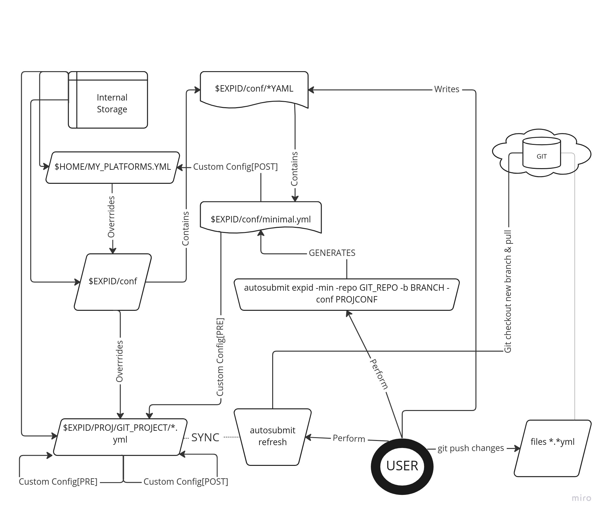

Configuration details, setup and sharing
========================================

Experiment configuration
------------------------

Since the beginning, Autosubmit has always been composed of five files in the folder ``$expid/conf`` that define the experiment configuration.

However, from Autosubmit 4, the configuration is no longer bound to one specific location. And it is composed of YAML files.

This document will teach you how to set up an experiment configuration using the different available methods and what Autosubmit expects to find in the configuration.

Standard configuration structure
---------------------------------

The standard configuration is the one that is used by default. It is composed of five files in the folder ``$expid/conf`` that define the experiment configuration.

This configuration is generated by the ``expid`` command without any opcional flag or when using the -dm flag.

The following table summarizes what configuration files Autosubmit expects and what parameters you can define.

.. list-table::
    :header-rows: 1
    :widths: 20 80

    * - File
      - Content
    * - ``expdef_<EXPID>.yml``
      -
        * It contains the default platform, the one set with -H.
        * Allows changing the start dates, members and chunks.
        * Allows changing the experiment project source ( git, local, svn or dummy)
    * - ``platforms_<EXPID>.yml``
      -
        * It contains the list of platforms to use in the experiment.
        * This file must be filled-up with the platform(s) configuration(s).
        * Several platforms can be defined and used in the same experiment.
    * - ``jobs_<EXPID>.yml``
      -
        - It contains the tasks' definitions in sections.
        - This file must be filled-up with the tasks' definitions.
        - Several sections can be defined and used in the same experiment.
    * - ``autosubmit_<EXPID>.yml``
      -
        - Parameters that control workflow behavior.
        - Parameters that activate extra functionalities.
    * - ``proj_<EXPID>.yml``
      -
        - Project-dependent parameters.
    * - ``version_<EXPID>.yml``
      -
        - Current AS version for this experiment.

It is worth mentioning that for Autosubmit 4, these files are seen as one. Therefore, the sections and parameters can be defined in any of the files.

.. note:: The ``version.yml`` file is automatically generated by Autosubmit. It is not necessary to create it.
.. note:: Autosubmit only admits the use of the ``.yml`` and ``.yaml`` ( lowercase ) extensions for the configuration files.

Advanced configuration structure and restrictions
-------------------------------------------------

From Autosubmit4, the configuration structure can be split into multiple locations and different files.

The experiment must have a `*-minimal.yml` file in `$expid/conf`  in the `$expid/conf` folder. This file is used to define the location of the configuration files and can be generated by the `expid` command when using with -min flag.
This location can be defined by the user in the `DEFAULT.CONFIG_DIR` parameter inside a file ending with `minimal.yml` or `minimal.yaml` file.

* You would define the model-specific parameters inside your git or local repository. So when you push/pull the changes from git, they will be updated automatically.
* You would define the experiment-specific parameters under `$expid/conf`.
* You would define your user-specific parameters, for example, platform user, in a different location.

.. _create_and_share_config:

How to create and share the configuration
-------------------------------------------

This section contains examples of creating a standard configuration and an advanced one from a newly made experiment.

Standard Configuration
~~~~~~~~~~~~~~~~~~~~~~

The expid command can generate a sample structure containing all the parameters that Autosubmit needs to work correctly.

.. code-block:: bash

   #Create a new experiment.
   autosubmit expid -H "LOCAL" -d "Standard configuration."
   # Get the expid from the output. Ex. expid=a000
   cd $autosubmit_experiment_folder/a000
   ls conf
   autosubmit_a01y.yml  expdef_a01y.yml  platforms_a01y.yml
        jobs_a01y.yml    proj_a01y.yml

Sharing a standard Configuration
~~~~~~~~~~~~~~~~~~~~~~~~~~~~~~~~

The expid command can copy another user's existing expid to work correctly.

.. code-block:: bash

   #Create a new experiment.
   autosubmit expid  --copy a000 -H "LOCAL" -d "Standard configuration. --copy of a000"
   # Get the expid from the output. Ex. expid=a001
   cd $autosubmit_experiment_folder/a001
   ls conf
   autosubmit_a001.yml  expdef_a001.yml  platforms_a001.yml
    jobs_a001.yml    proj_a001.yml

.. warning:: You must share the same Autosubmit experiment database for this to work.

.. _advanced_features:

Advanced Configuration
~~~~~~~~~~~~~~~~~~~~~~

Autosubmit is now able to find the configuration files in different locations. The user can define the location of the configuration files in the `DEFAULT.CONFIG_DIR` parameter inside a file ending with `minimal.yml` or `minimal.yaml` file.

An skeleton of the advanced configuration can be generated through the `expid` command when using the `-min` flag.

.. code-block:: bash

   #Create a new experiment.
   autosubmit expid -min -d "Test minimal conf"
   # Get the expid from the output. Ex. expid=a002
   cd $autosubmit_experiment_folder/a002
   ls conf
   minimal.yml

To give a practical example, we will show an example using git. However, using a non-git folder is also possible.

Edit or generate a `minimal.yml` with the following parameters, leaving the rest untouched.

.. code-block:: yaml

    DEFAULT:
        #ADD, note that %PROJDIR% is an special AS_PLACEHOLDER that points to the `$expid/proj/proj_destination` folder.
        CUSTOM_CONFIG:
            PRE: "%PROJDIR%/<path_to_model_as_conf>"
            POST: <path_to_user_conf>
    PROJECT:
        PROJECT_TYPE: "git"
        PROJECT_DESTINATION: "git_project"
    GIT:
        PROJECT_ORIGIN: "TO_FILL"
        PROJECT_BRANCH: "TO_FILL"
        PROJECT_COMMIT: "TO_FILL"
        PROJECT_SUBMODULES: "TO_FILL"
        FETCH_SINGLE_BRANCH: True

.. important:: The final configuration will be loaded in the following order: `PRE`:`$expid/%PROJDIR%/$as_proj_config_path` ->  `$expid/conf` ->  `POST`. Overwriting the parameters in the order they are loaded.

.. note::

  ``PROJECT_SUBMODULES`` can be set to ``false`` (without quotes), which will be
  evaluated as ``False`` in Python, and will disable the Git submodules (i.e. no
  submodules will be cloned).

CUSTOM_CONFIG: Syntax
^^^^^^^^^^^^^^^^^^^^^
The %DEFAULT.CUSTOM_CONFIG% parameter is used to define the location of the model/project or user files. The paths can be absolute or relative to the ``%PROJDIR%``.

It has two different syntaxes:

* *Simple* a list of paths to the model or project yaml files. This can be a file or a folder. If it is a folder, all the files inside will be loaded in a non-recursive way.
* *Advanced* a dictionary with two keys: ``PRE`` and ``POST``. The ``PRE`` key is used to define the files that will be loaded before the ``$EXPID/CONF`` ones. The ``POST`` key is used to define user configuration.

.. note:: With the simple syntax, the outcome is the same as the advanced one, but with the ``POST`` key empty.
.. note:: If a list of path is provided, the paths will be loaded in the order they are provided and in a recursive way. Meaning that in the case there are additional ``DEFAULT.CUSTOM_CONFIG`` parameter inside the files, they will be also loaded.

.. code-block:: yaml

   # Download the git project
   autosubmit create a002
   autosubmit refresh a002

.. warning:: Keep in mind that no parameters are disabled when custom_config is activated, including the jobs definitions.

Advanced configuration - Full dummy example (reproducible)
----------------------------------------------------------

.. code-block:: bash

   #Create a new experiment.
   autosubmit expid -min -repo https://earth.bsc.es/gitlab/ces/auto-advanced_config_example -b main -conf as_conf -d "Test minimal conf"
   # expid=a04b
   dbeltran@bsces107894: cd ~/autosubmit/a04b
   dbeltran@bsces107894:~/autosubmit/a04b$ ls conf
   minimal.yml

.. code-block:: bash

    cat ~/autosubmit/conf/minimal.yml

.. code-block:: yaml

    CONFIG:
      AUTOSUBMIT_VERSION: "4.0.0b"
    DEFAULT:
        EXPID: "a04b"
        HPCARCH: "local"
        #ADD, note that %PROJDIR% is an special AS_PLACEHOLDER that points to the expid folder.
        #hint: use %PROJDIR% to point to the project folder (where the project is cloned)
        CUSTOM_CONFIG: "%PROJDIR%/as_conf"
    PROJECT:
        PROJECT_TYPE: "git"
        PROJECT_DESTINATION: "git_project"
    GIT:
        PROJECT_ORIGIN: "https://earth.bsc.es/gitlab/ces/auto-advanced_config_example"
        PROJECT_BRANCH: "main"
        PROJECT_COMMIT: ""
        PROJECT_SUBMODULES: ""

.. code-block:: bash

    # Download the git project to obtain the distributed configuration
    dbeltran@bsces107894: autosubmit refresh a04b
    # Check the downloaded model-configuration
    dbeltran@bsces107894:~/autosubmit/a04b$ ls proj/git_project/as_conf/
    autosubmit_<EXPID>.yml  expdef.yml  jobs.yml  platforms.yml

Model configuration is distributed at `git. <https://earth.bsc.es/gitlab/ces/auto-advanced_config_example/-/tree/main/as_conf>`_

.. code-block:: bash

    dbeltran@bsces107894:~/autosubmit/a04b$ cat ~/as_user_conf/platforms.yml

.. code-block:: yaml

    Platforms:
      MARENOSTRUM4:
        USER: bsc32xxx
        QUEUE: debug
        MAX_WALLCLOCK: "02:00"
      marenostrum_archive:
        USER: bsc32xxx
      transfer_node:
        USER: bsc32xxx
      transfer_node_bscearth000:
        USER: dbeltran
      bscearth000:
        USER: dbeltran
      nord3:
        USER: bsc32xxx
      ecmwf-xc40:
        USER: c3d

.. Note:: The user configuration is not distributed, it is a local file that must be edited by the user.

.. code-block:: yaml

   # Create and run the experiment, since it contains all the info!
   autosubmit create a04b  # if $expid/proj doesn't exists
   autosubmit refresh a04b
   autosubmit run a04b

The following figure shows the flow of the execution.

   Advanced configuration example

Sharing an advanced configuration
~~~~~~~~~~~~~~~~~~~~~~~~~~~~~~~~~

The expid command can copy another user's existing expid to work correctly.

.. note:: This only copies the ``$expid/conf/{*.yml,*yaml}`` experiment configuration files.

.. code-block:: bash

   #Create a new experiment.
   autosubmit expid --copy a002 -H "LOCAL" -d "Advanced configuration. --copy of a002"
   # Get the expid from the output. Ex. expid=a004
   cd $autosubmit_experiment_folder/a004
   ls conf
   minimal.yml
   autosubmit create a004

.. warning:: All users must share the same experiment autosubmit.db for this to work. More info at `shared-db <https://autosubmit.readthedocs.io/en/master/installation/index.html#production-environment-installation-shared-filesystem-database>`_

Sharing an experiment configuration across filesystems is possible only by including the same `DEFAULT.CUSTOM_CONFIG` and `GIT.PROJECT_ORIGIN`, `GIT.PROJECT_BRANCH` and `GIT.PROJECT_TAG` inside the expdef.yml file.
