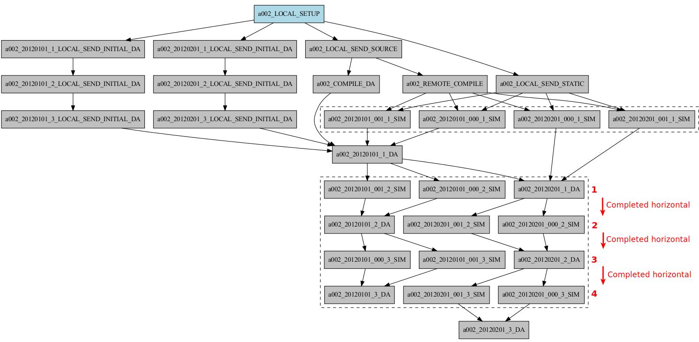

Wrappers
========

Job packages, or "wrappers", are jobs created as bundles of different tasks (submitted at once in a single script to the platform) assembled by Autosubmit to maximize the usage of platforms managed by a scheduler (by minimizing the queuing time between consecutive or concurrent tasks). Autosubmit supports four wrapper types that can be used depending on the experiment’s workflow.

* Horizontal_
* Vertical_
* Horizontal-vertical_
* Vertical-horizontal_

.. note:: To have a preview of wrappers, you must use the parameter `-cw` available on inspect, monitor, and create.

.. code-block:: bash

	autosubmit create <expid> -cw  # Unstarted experiment
	autosubmit monitor <expid> -cw # Ongoing experiment
	autosubmit inspect <expid> -cw -f # Visualize wrapper cmds

General Configuration
=====================

To configure a new wrapper, the user has to define a `WRAPPERS` section in any configuration file. When using the standard configuration, this one is autosubmit.yml.

.. code-block:: YAML

	WRAPPERS:
		WRAPPER_0:
			TYPE: "horizontal"

By default, Autosubmit will try to bundle jobs of the same type. The user can alter this behavior by setting the `JOBS_IN_WRAPPER` parameter directive in the wrapper section.

When using multiple wrappers or 2-dim wrappers is essential to define the `JOBS_IN_WRAPPER` parameter.

.. code-block:: YAML

	JOBS:
		JOB_0:
			FILE: test.sh
			RUNNING: chunk
		JOB_1:
			FILE: test2.sh
			DEPENDENCY: "JOB_0 JOB_1-1"
			RUNNING: chunk
	WRAPPERS:
		WRAPPER_0:
			TYPE: "horizontal"
			JOBS_IN_WRAPPER: "JOB_0"
		WRAPPER_1:
			TYPE: "vertical"
			JOBS_IN_WRAPPER: "JOB_1"

<missing img>

.. important:: Autosubmit will not wrap tasks with external and non-fulfilled dependencies.

Wrapper check time
------------------
The CHECK_TIME_WRAPPER parameter defines the frequency, in seconds, on which Autosubmit will check the remote platform status of all the wrapper tasks.

	WRAPPERS:
		CHECK_TIME_WRAPPER: 10
		WRAPPER_0:
			TYPE: "horizontal"
			JOBS_IN_WRAPPER: "JOB_0"
		WRAPPER_1:
			TYPE: "vertical"
			JOBS_IN_WRAPPER: "JOB_1"

Number of jobs in a wrapper
-----------------------------

Users can configure the maximum and the minimum number of jobs in each wrapper by configuring MAX_WRAPPED and MIN_WRAPPED inside the wrapper section. If the user doesn't set them, Autosubmit will default to MAX_WRAPPED: “infinite” and MIN_WRAPPED: 2.

.. code-block:: YAML

	WRAPPERS:
		MIN_WRAPPED: 2
		MAX_WRAPPED: 999999
		WRAPPER_0:
			MAX_WRAPPED: 2
			TYPE: "horizontal"
			JOBS_IN_WRAPPER: "JOB_0"
		WRAPPER_1:
			TYPE: "vertical"
			JOBS_IN_WRAPPER: "JOB_1"

For 2-dim wrappers, {MAX_MIN}_WRAPPED_{V/H} must be used instead of the general one.

.. code-block:: YAML

	WRAPPERS:
		MIN_WRAPPED: 2
		MAX_WRAPPED: 999999
		WRAPPER_0:
			MAX_WRAPPED_H: 2
			MAX_WRAPPED_V: 4
			MIN_WRAPPED_H: 2
			MIN_WRAPPED_V: 2
			TYPE: "horizontal-vertical"
			JOBS_IN_WRAPPER: "JOB_0 JOB_1"

Wrapper Policy
---------------

Autosubmit will wrap as many tasks as possible while respecting the limits set in the configuration(MAX_WRAPPED, MAX_WRAPPED_H, MAX_WRAPPED_V, MIN_WRAPPED, MIN_WRAPPED_V, and MIN_WRAPPED_H parameters). However, users have three different policies available to tune the behavior in situations where there aren’t enough tasks in general, or there are uncompleted tasks remaining from a failed wrapper job:

* Flexible: if there aren’t at least MIN_WRAPPED tasks to be grouped, Autosubmit will submit them as individual jobs.
* Mixed: will wait for MIN_WRAPPED jobs to be available to create a wrapper, except if one of the wrapped tasks had failed beforehand. In this case, Autosubmit will submit them individually.
* Strict: will always wait for MIN_WRAPPED tasks to be ready to create a wrapper.

.. warning: Mixed and strict policies can cause deadlocks.

.. code-block:: YAML

	WRAPPERS:
		POLICY: "flexible"
		WRAPPER_0:
			TYPE: "vertical"
			JOBS_IN_WRAPPER: "JOB_0 JOB_1"

.. _Vertical:

Vertical wrapper
================

Vertical wrappers are suited for sequential dependent jobs (e.x. chunks of SIM tasks that depend on the previous chunk). Defining the platform’s  `MAX_WALLCLOCK` is essential since the wrapper's total wallclock time will be the sum of each job and will be a limiting factor for the creation of the wrapper, which will not bundle more jobs than the ones fitting in the wallclock time.

Autosubmit supports wrapping together vertically jobs of different types.

.. code-block:: YAML

	WRAPPERS:
		WRAPPER_V:
			TYPE: "vertical"
			JOBS_IN_WRAPPER: "JOB_0"

.. _Horizontal:

Horizontal wrapper
==================

Horizontal wrappers are suited for jobs that must run parallel (e.x. members of SIM tasks). Defining the platform’s  `MAX_PROCESSORS` is essential since the wrapper processor amount will be the sum of each job and will be a limiting factor for the creation of the wrapper, which will not bundle more jobs than the ones fitting in the `MAX_PROCESSORS` of the platform.

.. code-block:: YAML

	WRAPPERS:
		WRAPPER_H:
			TYPE: "horizontal"
			JOBS_IN_WRAPPER: "JOB_0"

.. _Vertical-horizontal:

Vertical-horizontal wrapper
===========================

The vertical-horizontal wrapper allows bundling together a vertical sequence of tasks independent of the horizontal ones. Therefore, all horizontal tasks do not need to finish to progress to the next horizontal level.

.. _Horizontal-vertical:

Horizontal-vertical wrapper
===========================

The horizontal-vertical wrapper allows bundling together tasks that could run simultaneously but need to communicate before progressing to the next horizontal level.

Example: Crossdate wrappers using the the new dependencies
----------------------------------------------------------

Considering the following configuration:

.. code-block:: yaml

    experiment:
      DATELIST: 20120101 20120201
      MEMBERS: "000 001"
      CHUNKSIZEUNIT: day
      CHUNKSIZE: '1'
      NUMCHUNKS: '3'

    JOBS:
      LOCAL_SETUP:
        FILE: templates/local_setup.sh
        PLATFORM: marenostrum_archive
        RUNNING: once
        NOTIFY_ON: COMPLETED
      LOCAL_SEND_SOURCE:
        FILE: templates/01_local_send_source.sh
        PLATFORM: marenostrum_archive
        DEPENDENCIES: LOCAL_SETUP
        RUNNING: once
        NOTIFY_ON: FAILED
      LOCAL_SEND_STATIC:
        FILE: templates/01b_local_send_static.sh
        PLATFORM: marenostrum_archive
        DEPENDENCIES: LOCAL_SETUP
        RUNNING: once
        NOTIFY_ON: FAILED
      REMOTE_COMPILE:
        FILE: templates/02_compile.sh
        DEPENDENCIES: LOCAL_SEND_SOURCE
        RUNNING: once
        PROCESSORS: '4'
        WALLCLOCK: 00:50
        NOTIFY_ON: COMPLETED
      SIM:
        FILE: templates/05b_sim.sh
        DEPENDENCIES:
          LOCAL_SEND_STATIC:
          REMOTE_COMPILE:
          SIM-1:
          DA-1:
        RUNNING: chunk
        PROCESSORS: '68'
        WALLCLOCK: 00:12
        NOTIFY_ON: FAILED
      LOCAL_SEND_INITIAL_DA:
        FILE: templates/00b_local_send_initial_DA.sh
        PLATFORM: marenostrum_archive
        DEPENDENCIES: LOCAL_SETUP LOCAL_SEND_INITIAL_DA-1
        RUNNING: chunk
        SYNCHRONIZE: member
        DELAY: '0'
      COMPILE_DA:
        FILE: templates/02b_compile_da.sh
        DEPENDENCIES: LOCAL_SEND_SOURCE
        RUNNING: once
        WALLCLOCK: 00:20
        NOTIFY_ON: FAILED
      DA:
        FILE: templates/05c_da.sh
        DEPENDENCIES:
          SIM:
          LOCAL_SEND_INITIAL_DA:
            CHUNKS_TO: "all"
            DATES_TO: "all"
            MEMBERS_TO: "all"
          COMPILE_DA:
          DA:
            DATES_FROM:
             "20120201":
               CHUNKS_FROM:
                1:
                 DATES_TO: "20120101"
                 CHUNKS_TO: "1"
        RUNNING: chunk
        SYNCHRONIZE: member
        DELAY: '0'
        WALLCLOCK: 00:12
        PROCESSORS: '256'
        NOTIFY_ON: FAILED

.. code-block:: yaml

    wrappers:
        wrapper_simda:
            TYPE: "horizontal-vertical"
            JOBS_IN_WRAPPER: "SIM DA"

