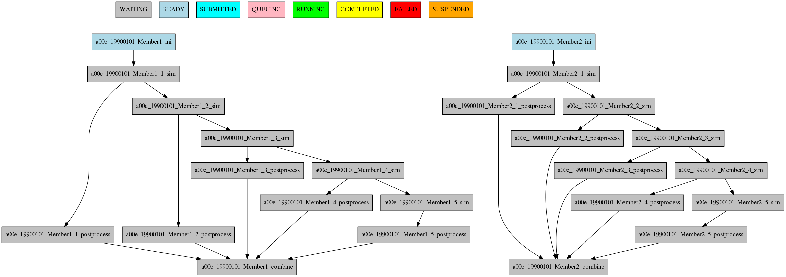
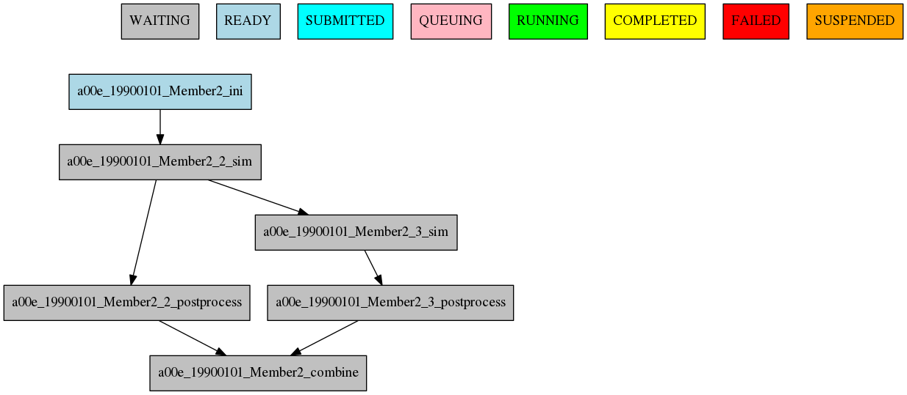

##################
Defining workflows
##################

Simple workflow
--------------_

.. code-block:: ini
    [One]
    FILE = one.sh

    [Two]
    FILE = two.sh
    DEPENDENCIES = One

.. figure:: workflows/simple.png
   :width: 85%
   :align: center
   :alt: simple workflow plot

Running jobs once per startdate, member and chunk
-------------------------------------------------
2 startdates, 2 members, 2 chunks

.. code-block:: ini
    [once]
    FILE = Once.sh

    [date]
    FILE = date.sh
    DEPENDENCIES = once
    RUNNING = date

    [member]
    FILE = Member.sh
    DEPENDENCIES = date
    RUNNING = member

    [chunk]
    FILE = Chunk.sh
    DEPENDENCIES = member
    RUNNING = chunk

.. figure:: workflows/running.png
   :width: 85%
   :align: center
   :alt: simple workflow plot

Dependencies
------------

Dependencies with previous jobs

.. code-block:: ini
    [ini]
    FILE = ini.sh
    RUNNING = member

    [sim]
    FILE = sim.sh
    DEPENDENCIES = ini sim-1
    RUNNING = chunk

    [postprocess]
    FILE = postprocess.sh
    DEPENDENCIES = sim
    RUNNING = chunk

.. figure:: workflows/dependencies_previous.png
   :width: 85%
   :align: center
   :alt: simple workflow plot

Dependencies between running levels

.. code-block:: ini
    [ini]
    FILE = ini.sh
    RUNNING = member

    [sim]
    FILE = sim.sh
    DEPENDENCIES = ini sim-1
    RUNNING = chunk

    [postprocess]
    FILE = postprocess.sh
    DEPENDENCIES = sim
    RUNNING = chunk

    [combine]
    FILE = combine.sh
    DEPENDENCIES = postprocess
    RUNNING = member

Job frequency
-------------

.. code-block:: ini
    [ini]
    FILE = ini.sh
    RUNNING = member

    [sim]
    FILE = sim.sh
    DEPENDENCIES = ini sim-1
    RUNNING = chunk

    [postprocess]
    FILE = postprocess.sh
    DEPENDENCIES = sim
    RUNNING = chunk
    FREQUENCY = 3

    [combine]
    FILE = combine.sh
    DEPENDENCIES = postprocess
    RUNNING = member

.. figure:: workflows/frequency.png
   :width: 85%
   :align: center
   :alt: simple workflow plot

Rerun dependencies
------------------

Chunks 2 and 3 of Member2

.. code-block:: ini
    [ini]
    FILE = ini.sh
    DEPENDENCIES = ini sim-1
    RUNNING = member

    [sim]
    FILE = sim.sh
    RERUN_DEPENDENCIES = ini combine
    RUNNING = chunk

    [postprocess]
    FILE = postprocess.sh
    DEPENDENCIES = sim
    RUNNING = chunk

    [combine]
    FILE = combine.sh
    DEPENDENCIES = postprocess
    RUNNING = member

